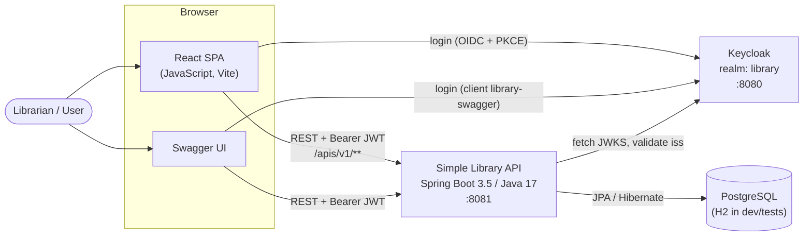
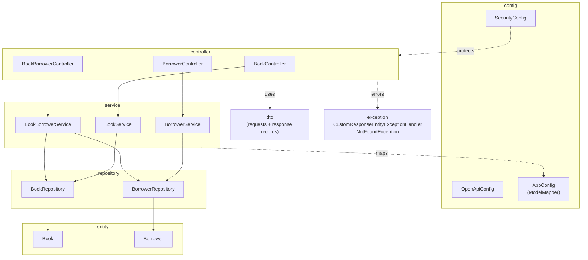
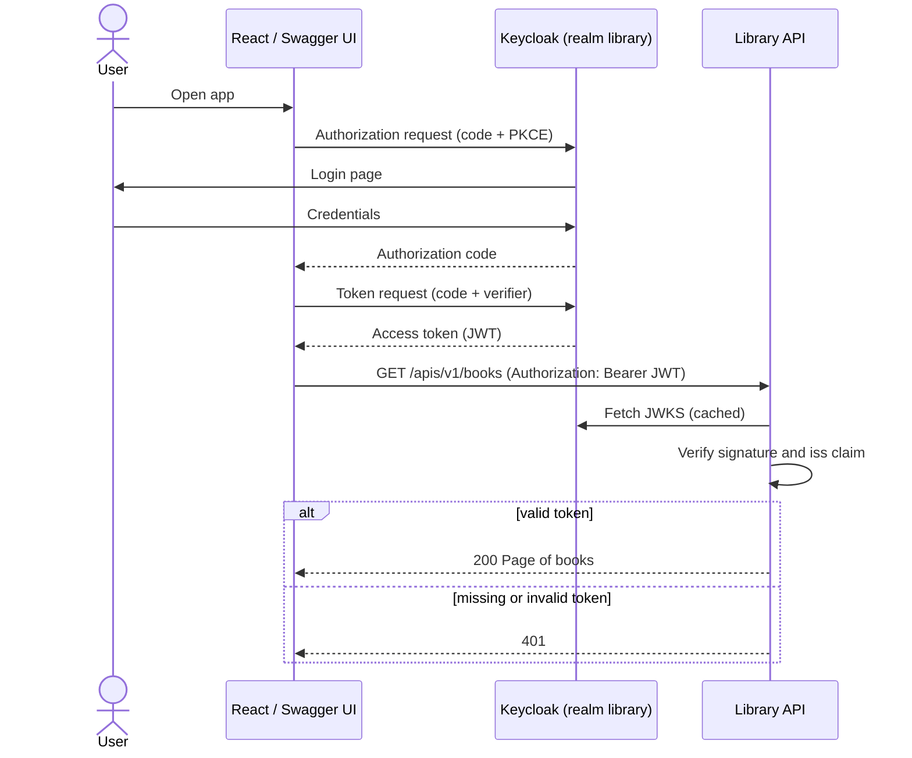
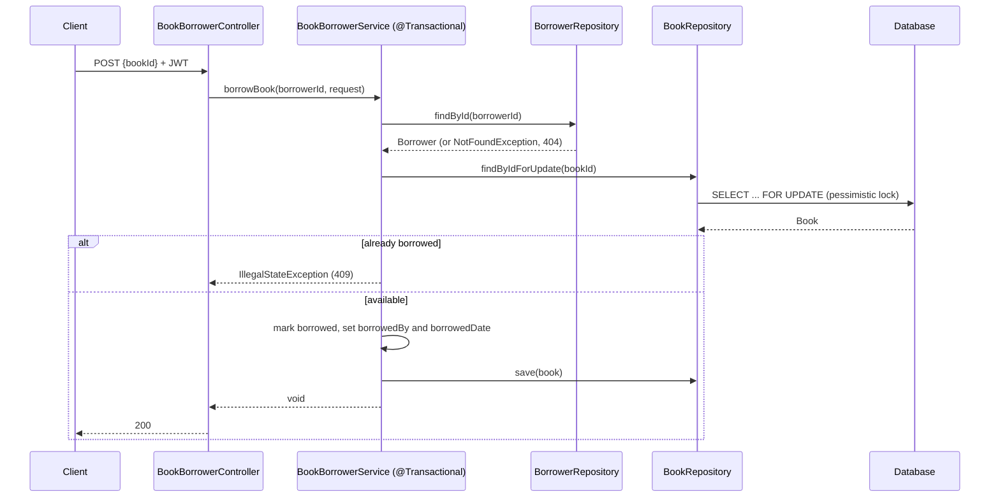
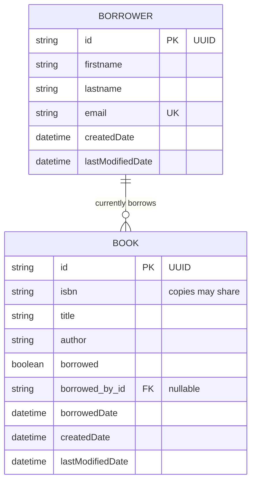
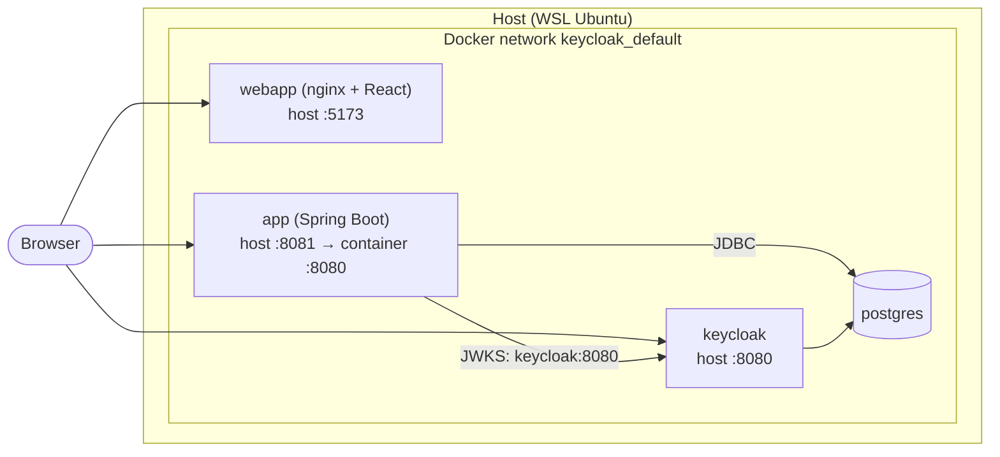

# Architecture diagrams

Diagrams are written in [Mermaid](https://mermaid.js.org/) so they are plain text, reviewable in PR diffs
and rendered natively by GitHub. Edit them in place, or paste a block into
[Mermaid Chart](https://www.mermaidchart.com/) for a visual editor.

| Diagram | Purpose |
|---|---|
| [System context](#1-system-context) | Who talks to whom (browser, React, API, Keycloak, DB) |
| [Backend layers](#2-backend-layers) | Packages and dependencies inside the Spring Boot app |
| [Login and API call](#3-login-and-api-call-sequence) | OAuth2 / PKCE flow and JWT validation |
| [Borrow a book](#4-borrow-a-book-sequence) | Transactional borrow with pessimistic lock |
| [Data model](#5-data-model) | Entities and relationships |
| [Deployment](#6-deployment-docker-compose) | Containers and ports (local Docker) |

## 1. System context

## 2. Backend layers

Base package `com.ascendion.roshan.simple_library`.

## 3. Login and API call (sequence)

## 4. Borrow a book (sequence)

`POST /apis/v1/borrowers/{borrower-id}/books`

## 5. Data model

Fields are indicative; check `entity/Book.java` and `entity/Borrower.java` for the source of truth.

## 6. Deployment (Docker Compose)

> `k8s/` holds equivalent manifests for the app and PostgreSQL (`app-deployment`, `app-service`, `postgres-deployment`, `postgres-pvc`).
